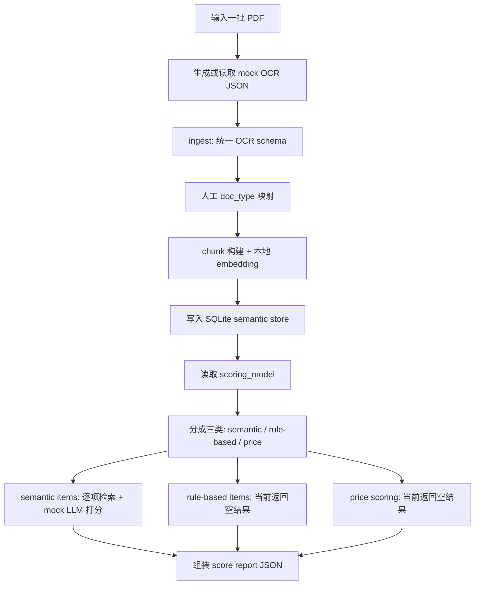

# Local Semantic Engine Workflow

这份文档说明当前仓库中本地语义检索与 mock 打分链路的整体工作方式、mock 边界、安装方法、运行方法，以及示例输出。

## 1. 目标

当前这套链路的目标是：

- 读取一批投标 PDF
- 生成 OCR-compatible 的 mock JSON
- 将文档内容按 chunk 写入本地 semantic store
- 按 `zhaobiao_file_model.json` 中的评分项执行检索
- 对 semantic 类评分项输出 mock 分数
- 对 rule-based 和 price scoring 先返回空结果

当前实现重点是把流程跑通，不是完整评标总分系统。

## 2. 目录说明

- 代码实现：
  [local_semantic_engine](/C:/Users/kaitao/codes/toubiao_analysis/local_semantic_engine)
- demo 输入文件：
  [sample_toubiao_files](/C:/Users/kaitao/codes/toubiao_analysis/sample_toubiao_files)
- mock OCR 文件：
  [sample_toubiao_files/mock_ocr](/C:/Users/kaitao/codes/toubiao_analysis/sample_toubiao_files/mock_ocr)
- doc_type 映射：
  [sample_toubiao_files/doc_types.json](/C:/Users/kaitao/codes/toubiao_analysis/sample_toubiao_files/doc_types.json)
- mock 打分结果：
  [sample_toubiao_files/mock_score_report.json](/C:/Users/kaitao/codes/toubiao_analysis/sample_toubiao_files/mock_score_report.json)
- 本地 semantic store：
  [.semantic_store/semantic_store.sqlite3](/C:/Users/kaitao/codes/toubiao_analysis/.semantic_store/semantic_store.sqlite3)

`mock_score_report.json` 是 demo 产物的一部分，保留在 git tree 中，便于直接查看结果结构。

## 3. 整体 Workflow



## 4. Mock 部分说明

当前 mock 只发生在两层。

### 4.1 Mock OCR

当前不是图像 OCR。

实际做法是：

1. 用 `pypdf` 读取 PDF 的文本层
2. 对每一页执行 `extract_text()`
3. 按段落切成 blocks
4. 包装成和现有 OCR 输出兼容的 JSON schema

也就是说，当前 OCR mock 的本质是：

`pdf2text + OCR schema mock`

不是：

`图像识别 OCR`

如果 PDF 是文本型 PDF，这条路可以工作；如果是纯扫描件，则需要未来切到真实 OCR。

### 4.2 Mock Scoring

当前 scoring 模块只真正实现了 semantic scoring。

semantic scoring 的流程是：

1. 从 `zhaobiao_file_model.json` 读取 semantic 评分项
2. 对每个 item 取：
   - `required_doc_types`
   - `retrieval_hints.keywords`
   - `retrieval_hints.semantic_queries`
3. 去本地 semantic store 检索 evidence chunks
4. 构造 prompt
5. 送给 mock heuristic scorer
6. 输出 item 级分数

当前三类评分项的状态：

- semantic scoring:
  已实现，返回 mock 分数
- rule-based scoring:
  暂未实现，返回空结果
- price scoring:
  暂未实现，返回空结果

## 5. 当前 Scoring 逻辑

当前 scoring 模块在
[local_semantic_engine/scoring.py](/C:/Users/kaitao/codes/toubiao_analysis/local_semantic_engine/scoring.py)
中工作。

整体逻辑是：

1. 读取 `scoring_model`
2. 把评分内容分成三类：
   - semantic items
   - rule-based items
   - price item
3. 分别处理：
   - semantic items: 逐项打分
   - rule-based items: 当前返回空结果
   - price item: 当前返回空结果
4. 最终组装输出：
   - `semantic_scoring_results`
   - `rule_based_results`
   - `price_result`
   - `errors`

## 6. 安装说明

### 6.1 Python

建议 Python 3.10+。

### 6.2 安装依赖

当前 mock 链路最关键的依赖是 `pypdf`。

如果你只想跑当前 demo，至少需要：

```bash
pip install pypdf
```

如果你需要安装仓库已有依赖：

```bash
pip install -r requirements.txt
```

## 7. 运行方法

### 7.1 生成 mock OCR

```bash
python -m local_semantic_engine.mock_ocr_builder ^
  --input-dir sample_toubiao_files ^
  --output-dir sample_toubiao_files/mock_ocr
```

### 7.2 跑端到端 mock pipeline

```bash
python -m local_semantic_engine pipeline ^
  --project-id demo-project ^
  --store-dir .semantic_store ^
  --model-path zhaobiao_file_model.json ^
  --runtime-mode mock ^
  --mock-ocr-dir sample_toubiao_files/mock_ocr ^
  --doc-types-json sample_toubiao_files/doc_types.json ^
  sample_toubiao_files\\*.pdf
```

如果你的环境里 `python` 不可用，也可以显式指定解释器路径，例如：

```powershell
$pdfs = Get-ChildItem .\sample_toubiao_files -Filter *.pdf | ForEach-Object { $_.FullName }
$env:PYTHONIOENCODING='utf-8'
& 'C:\Users\kaitao\AppData\Local\Programs\Python\Python312-arm64\python.exe' -m local_semantic_engine pipeline `
  --project-id demo-project `
  --store-dir .semantic_store `
  --model-path zhaobiao_file_model.json `
  --runtime-mode mock `
  --mock-ocr-dir .\sample_toubiao_files\mock_ocr `
  --doc-types-json .\sample_toubiao_files\doc_types.json `
  @pdfs > .\sample_toubiao_files\mock_score_report.json
```

### 7.3 单独查看 semantic scoring items

```bash
python -m local_semantic_engine list-semantic-items --model-path zhaobiao_file_model.json
```

### 7.4 单独搜索

```bash
python -m local_semantic_engine search ^
  --project-id demo-project ^
  --store-dir .semantic_store ^
  --doc-types construction_plan ^
  --keywords 施工机械设备 设备投入计划 ^
  --queries "施工机械设备配置是否满足施工需要"
```

## 8. 结果文件说明

端到端 mock pipeline 的结果默认可以重定向保存到：

[sample_toubiao_files/mock_score_report.json](/C:/Users/kaitao/codes/toubiao_analysis/sample_toubiao_files/mock_score_report.json)

它包含两大块：

- `ingest_report`
- `score_report`

其中 `score_report` 下当前包含：

- `semantic_scoring_results`
- `rule_based_results`
- `price_result`
- `errors`

## 9. Sample JSON

下面是一个压缩后的示例，展示结果结构。

```json
{
  "ingest_report": {
    "project_id": "demo-project",
    "store_dir": "C:\\Users\\kaitao\\codes\\toubiao_analysis\\.semantic_store",
    "documents": [
      {
        "source_file": "第三章拟投入的主要施工机械设备计划.pdf",
        "doc_type": "construction_plan",
        "page_count": 4,
        "chunk_count": 42
      }
    ],
    "errors": []
  },
  "score_report": {
    "semantic_scoring_results": [
      {
        "item_id": "score_equipment_plan",
        "item_name": "投入的主要施工机械设备",
        "decision_mode": "rag_llm_scoring",
        "score": 0.55,
        "max_score": 1.0,
        "decision": "partial",
        "reasoning": "Mock rubric scoring ...",
        "confidence": 0.45,
        "matched_evidence_spans": [
          {
            "source_file": "第三章拟投入的主要施工机械设备计划.pdf",
            "page_start": 3,
            "quote": "第三节、主要施工机械设备投入的保证措施 ..."
          }
        ],
        "manual_review_required": true
      }
    ],
    "rule_based_results": [
      {
        "item_id": "score_pm_qualification",
        "item_name": "项目经理任职资格",
        "score": 0.0,
        "result": "",
        "reason": "",
        "evidence": [],
        "implemented": false
      }
    ],
    "price_result": {
      "item_id": "score_price",
      "item_name": "报价评分",
      "score": 0.0,
      "result": "",
      "reason": "",
      "evidence": [],
      "implemented": false
    },
    "errors": []
  }
}
```

完整真实示例见：
[sample_toubiao_files/mock_score_report.json](/C:/Users/kaitao/codes/toubiao_analysis/sample_toubiao_files/mock_score_report.json)

## 10. 当前边界

当前已经完成：

- mock OCR 文件生成
- 本地 semantic store 建库
- semantic scoring mock 打分
- 结果 JSON 输出

当前还未完成：

- rule-based scoring 真正实现
- price scoring 真正实现
- 最终总分聚合
- 真实 OCR 在生产链路下的最终接入验证

所以当前最准确的定位是：

这是一套可运行的 **mock end-to-end semantic scoring demo**。
